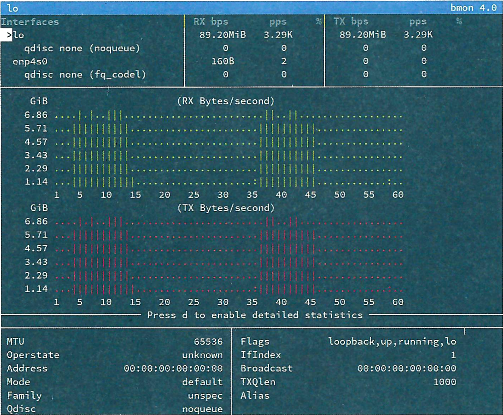
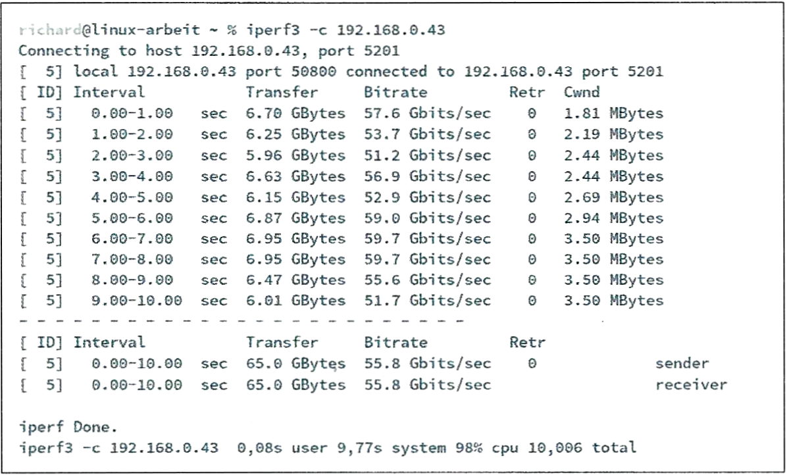
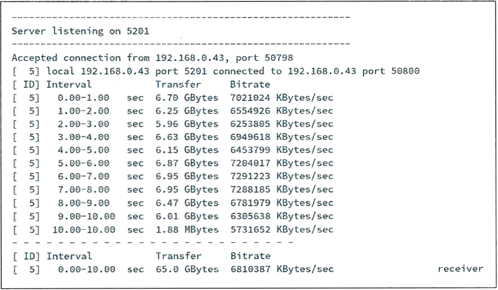

## Aufgabe 1

a)  Kreuzen Sie an, welche Informationen aus Ihrer Sicht eine
    Testspezifikation allgemein enthalten sollte.

    - [ ] Speicherort Testspezifikation

    - [ ] Erwartetes Testergebnis

    - [ ] Namen der Unternehmensleitung

    - [ ] Zielsetzung des Tests

    - [ ] Gründungsjahr der Firma

    - [ ] Durchzuführende Testschritte

    - [ ] Anschrift der Vertriebsfiliale

    <!-- -->

    - [x] Speicherort Testspezifikation

    - [x] Erwartetes Testergebnis

    - [ ] Namen der Unternehmensleitung

    - [x] Zielsetzung des Tests

    - [ ] Gründungsjahr der Firma

    - [x] Durchzuführende Testschritte

    - [ ] Anschrift der Vertriebsfiliale

<!-- -->

b)  Erstellen Sie ein Vorlagendokument für Testspezifikationen und
    Testprotokolle für die Infrastruktur, in denen die folgenden
    Informationen enthalten sind:

    - verfügbare Datenraten
    - Funktionsprüfungen
    - Normalfälle
    - Fehler und Ausnahmen
    - Testszenario
    - beteiligte Personen
    - Testdauer
    - Versionshinweis

    Ergänzen Sie die Vorlage um weitere Informationen, die aus Ihrer
    Sicht sinnvoll sind.

    ### Testspezifikation und Testprotokoll

    Projektname: \[Projektname\]  
    Datum: \[Datum\]  
    Verantwortlicher: \[Name des Verantwortlichen\]  
    Versionshinweis: \[Versionsnummer\]

    #### 1. Zielsetzung des Tests: {#zielsetzung-des-tests}

    \[Hier beschreiben Sie kurz das Hauptziel und den Zweck dieses
    Tests.\]

    #### 2. Testumgebung: {#testumgebung}

    **2.1 Hardware:**  
    Server: \[Server-Spezifikationen\] Client:
    \[Client-Spezifikationen\] Netzwerkgeräte: \[Liste der
    Netzwerkgeräte\]

    **2.2 Software:**  
    Betriebssystem: \[Betriebssystemversion\] Testwerkzeuge: \[Liste der
    verwendeten Testwerkzeuge\]

    #### 3. Testparameter: {#testparameter}

    **3.1 Verfügbare Datenraten:**  
    Downlink-Geschwindigkeit: \[Angabe der Downlink-Geschwindigkeit\]
    Uplink-Geschwindigkeit: \[Angabe der Uplink-Geschwindigkeit\]

    **3.2 Funktionsprüfungen:**  
    \[Liste der geplanten Funktionsprüfungen\]

    **3.3 Normalfälle:**  
    \[Liste der erwarteten Normalfälle\]

    **3.4 Fehler und Ausnahmen:**  
    \[Liste der erwarteten Fehler- und Ausnahmeszenarien\]

    **3.5 Testszenario:**  
    \[Detaillierte Beschreibung des geplanten Testszenarios\]

    #### 4. Durchzuführende Testschritte: {#durchzuführende-testschritte}

    \[Schritt 1: Beschreibung\]  
    \[Schritt 2: Beschreibung\]  
    \[Schritt 3: Beschreibung\]  
    ...

    #### 5. Beteiligte Personen: {#beteiligte-personen}

    \[Name und Rolle der am Test beteiligten Personen\]

    #### 6. Testdauer: {#testdauer}

    Startdatum: \[Startdatum\]  
    Enddatum: \[Enddatum\]

    #### 7. Testergebnisse: {#testergebnisse}

    **7.1 Verlauf des Tests:**  
    \[Beschreibung des Testverlaufs und eventuell aufgetretener
    Probleme\]  
    **7.2 Testergebnis:**  
    \[Fassen Sie die Testergebnisse zusammen, z. B. erfolgreich,
    teilweise erfolgreich, fehlgeschlagen\]

    #### 8. Zusammenfassung und Empfehlungen: {#zusammenfassung-und-empfehlungen}

    \[Hier geben Sie eine Zusammenfassung der Testergebnisse und
    mögliche Empfehlungen für weitere Schritte, falls erforderlich.\]

    #### 9. Genehmigung und Unterzeichnung: {#genehmigung-und-unterzeichnung}

    Verantwortlicher für den Test:  
    \[Unterschrift\] \[Datum\]

    Kontaktinformationen:  
    \[Fügen Sie Kontaktdaten für Rückfragen hinzu.\]

## Aufgabe 2

Erstellen Sie eine neue Testspezifikation für den beschriebenen Test und
das entsprechende Testprotokoll zur anschließenden Durchführung des
Tests.

Im Folgenden werden die Anforderungen an den Test beschrieben.

#### Test der Übertragungsrate zwischen einem Client und einem Server in einem bestehenden Netz

| iperf3-Software | bmon-Software |
|:---|:---|
| iperf3_3. 9-1_amd64. deb | bmon_4. 0-4build1_amd64. deb |
| libiperf0_3. 9-1_amd64. deb | libconfuse2_3. 2. 1+dfsg-4_amd64. deb |
| libsctp1_1. 0. 1 8+dfsg-1_amd64.deb | libconfuse-common_3. 2. 1+dfsg 4_all.deb |
| libssl1. 1_1. 1. 0g-2ubuntu4_amd64. deb | libnl-route-3-200_3. 2. 29-0ubuntu3_amd64. deb |
|  | libnl-3-200_3. 2. 29-0ubuntu3_amd64. deb |
|  |  |

Die Monitor-Software „bmon" ist in einem terminal-Fenster gestartet und
auf die Schnittstelle eingestellt, die geprüft werden soll (z. B. eth0).
Das Speedtest-Tool „iperf3" wird für die Messung der Übertragungsrate
verwendet.

| System | Parameter      | Bemerkung                             |
|:-------|:---------------|:--------------------------------------|
| Server | `iperf —s -fK` | zeige Übertragungsrate in KByte/s     |
| Client | `iperf -c`     | starte Test zur angegebenen Server-IP |

Die Übertragungsraten werden von „iperf" in Textform angezeigt und von
„bmon" grafisch dargestellt. Die folgenden Abbildungen zeigen dies
Ausgabe.

 bmon-Monitor-Tool

 iperf-Client

 iperf-Server

Der Server muss vor dem Client gestartet werden, ansonsten wird
„connection refused" gemeldet. Mit „bmon" wird die Grundlast auf dem
Netzabschnitt festgelegt. Die von „iperf" angezeigte Übertragungsrate
„Bitrate" soll mindestens 0,2 Gbit/sec betragen und mindestens 10% der
Grundlast ausmachen. Die Testdauer beträgt ca. 1 Minute.

### Testspezifikation für die Übertragungsratenmessung mit iperf3 und bmon

#### 1. Ziel des Tests: {#ziel-des-tests}

Überprüfung der Übertragungsrate zwischen einem Client und einem Server
in einem bestehenden Netzwerk.

#### 2. Testumgebung: {#testumgebung-1}

- Server:

  Betriebssystem: \[Betriebssystem des Servers\] Installierte Software:
  iperf3_3. 9-1_amd64. deb, libiperf0_3. 9-1_amd64. deb,
  libsctp1_1. 0. 1+dfsg-1_amd64. deb,
  libssl1. 1_1. 1. 0g-2ubuntu4_amd64. deb,
  libnl-route-3-200_3. 2. 29-0ubuntu3_amd64. deb,
  libnl-3-200_3. 2. 29-0ubuntu3_amd64. deb

- Client:

  Betriebssystem: \[Betriebssystem des Clients\] Installierte Software:
  iperf3_3. 9-1_amd64. deb, bmon_4. 0-4build1_amd64. deb,
  libconfuse2_3. 2. 1+dfsg-4_amd64. deb,
  libconfuse-common_3. 2. 1+dfsg-4_all. deb

- Netzwerkschnittstellen: \[Angabe der verwendeten Schnittstellen,
  z. B., eth0\]

#### 3. Testdurchführung: {#testdurchführung}

Starten Sie den Server mit dem folgenden Befehl: iperf -s -fK  
Starten Sie das bmon-Monitor-Tool und konfigurieren Sie es, um die
gewünschte Schnittstelle (z. B., eth0) zu überwachen.  
Starten Sie den Client mit dem folgenden Befehl: iperf -c
\[Server-IP\]  
Der Server muss vor dem Client gestartet werden, um "connection refused"
zu vermeiden.  
Die Testdauer beträgt ca. 1 Minute.

#### 4. Testkriterien: {#testkriterien}

Die Übertragungsrate ("Bitrate") wird von iperf in Textform angezeigt
und von bmon grafisch dargestellt.  
Die Mindestanforderung an die Übertragungsrate beträgt 0,2 Gbit/s (200
Mbit/s).  
Die Übertragungsrate sollte mindestens 10% der Grundlast des
Netzabschnitts ausmachen.

#### 5. Testprotokoll: {#testprotokoll}

Datum und Uhrzeit des Tests: \[Datum und Uhrzeit\]  
Server-IP-Adresse: \[Server-IP\]  
Verwendete Schnittstelle: \[Schnittstellenname, z. B., eth0\]  
Übertragungsrate (gemessen mit iperf): \[Gemessene Bitrate\]  
Grafische Darstellung der Übertragungsrate (bmon): \[Grafische
Darstellung\]  
Testergebnis: \[Bestanden / Nicht Bestanden\]  
Bemerkungen: \[Evtl. weitere Informationen oder Anmerkungen\]

#### 6. Testdurchführung: {#testdurchführung-1}

\[Beschreibung der tatsächlichen Testdurchführung, einschließlich
eventueller Probleme oder Abweichungen von der Spezifikation\]

#### 7. Testabschluss: {#testabschluss}

\[Zusammenfassung der Testergebnisse und ggf. Maßnahmen zur Behebung von
Problemen\]

#### 8. Testverantwortlicher: {#testverantwortlicher}

\[Name des Verantwortlichen\] \[Kontaktinformationen des
Verantwortlichen\]

#### 9. Genehmigung: {#genehmigung}

\[Name und Unterschrift des Testverantwortlichen\]
