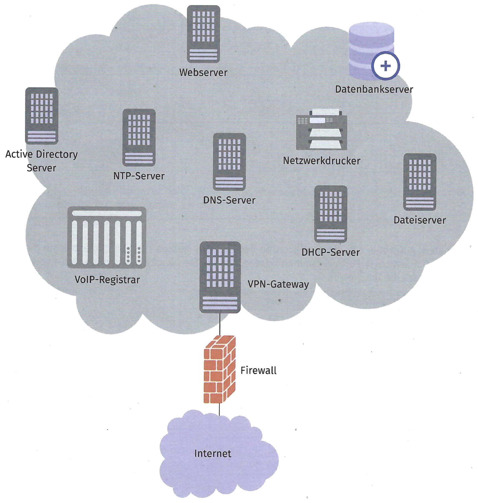
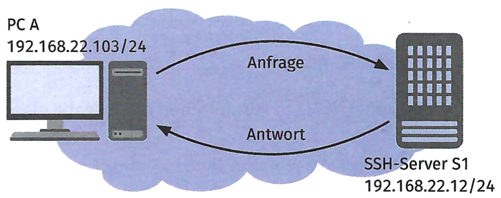

{width="75%"}

## Aufgabe 1

Erstellen Sie eine Übersicht mit den in der Skizze vorhandenen Diensten
(z. B. in einer Tabelle). Beschreiben Sie die grundlegende Funktion der
Dienste und notieren Sie ggf. einige technische Parameter (z. B. Port)
der Dienste.

| Dienst | Funktion | technische Parameter |
|----|----|----|
| DHCP - dynamic host configuration protocol | verteilt Netzwerkparameter (z. B. IPv4-Adresse und Subnetzmaske) an Clients | Port: 67, DORA-Prinzip |
|  |  |  |

## Aufgabe 2

Für spätere Aufgaben, z. B. die Konfiguration der Firewall, müssen für
bestimmte Dienste die entsprechenden OSI-Schicht-4-Ports gesammelt
werden. Ordnen Sie Dienste bestimmten Well-Known-Ports zu. Füllen Sie
dazu die Tabelle aus.

| Dienst | Port |
|--------|-----:|
|        |  123 |
|        |   80 |
| HTTPS  |      |
|        |   53 |
| IMAP   |      |
| FTP    |      |
|        |   22 |
|        |  161 |
|        |  993 |
| POP3S  |      |

## Aufgabe 3

Bei der Kommunikation zwischen Client und Server werden IP-Adressen und
Ports verwendet. Die Kombination wird „Socket" genannt. Gegeben ist die
nachfolgende Netzwerkskizze, in der PC A eine SSH-Verbindung mit dem
Server S1 aufbaut. Ergänzen Sie die Tabelle um die fehlenden Angaben.

{width="60%"}

| Verbindung | Quell-IP-Adresse | Quell-Port | Ziel-IP-Adresse | Ziel-Port |
|------------|------------------|------------|-----------------|-----------|
| Anfrage    | 192.168.22.103   | 35644      |                 |           |
|            |                  |            |                 |           |
