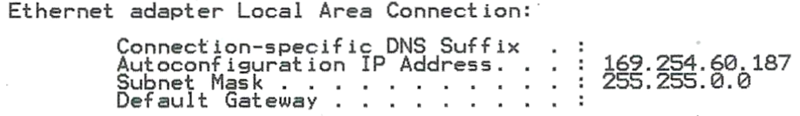

## Aufgabe 1

Beschreiben Sie den Nachrichtenverlauf bei DHCP.

## Aufgabe 2

Geben Sie drei Informationen an, welche bei einer DHCP-Offer-Nachricht
vom DHCP-Server an den Client gesendet werden.

## Aufgabe 3

Die DHCP- Request Nachricht wird als Broadcast-Nachricht an alle
Teilnehmer im Netzwerk gesendet. Begründen Sie dieses Vorgehen.

## Aufgabe 4

Eine DHCP-Request-Nachricht ist in einen Ethernet-Rahmen geschachtelt.
Es folgt der Mitschnitt eines Ethernet-Rahmens. Benennen Sie die Ziel-
und die Quell-MAC-Adresse.

- Ziel-Mac-Adresse (6 Byte)
- Quell-Mac-Adresse (6 Byte)
- Type (2 Byte)
- Daten (46--1500 Byte)
- Frage Check Sequence (4 Byte)

<!-- -->

    ff ff ff ff ff ff 08 00 27 e2 ed 6e 08 00 45 00
    01 67 00 01 00 00 80 11 39 86 00 00 00 00 0O ff

## Aufgabe 5

Diskutieren Sie in Partnerarbeit die Aufgabe eines DHCP-Relays bei DHCP.

## Aufgabe 6

Welche der Informationen können mittels DHCP verteilt werden?

- IPv4-Adresse

- Subnetzmaske

- Systemzeit

- DNS-Server

- Lease-Zeit

- ARP-Tabelle des Systems

## Aufgabe 7

Ein Client hat die nachfolgend dargestellte IP-Adressenkonfiguration.

{width="85%"}

Beschreiben Sie, aus welchem IP-Adressbereich die abgebildete Adresse
stammt und in welcher Situation ein Client diese Adresse bekommt.

## Aufgabe 8

Grenzen Sie die Begriffe „Lease-Time", „Renewal-Time" und „Rebind-Time"
voneinander ab.

## Aufgabe 9

Beschreiben Sie ein Anwendungsbeispiel für die automatische Zuordnung
bei DHCP.

## Aufgabe 10

Geben Sie mindestens fünf (typische) Parameter an, die mit DHCP
konfiguriert werden können.

## Aufgabe 11

Erläutern Sie die DHCP-Adressvergabeverfahren manuelle, automatische und
dynamische Zuordnung.

## Aufgabe 12

Beschreiben Sie Maßnahmen, um die Ausfallsicherheit von DHCP zu erhöhen.

## Aufgabe 13

Geben Sie an, was SLAAC bedeutet und erklären Sie, wie es funktioniert.
