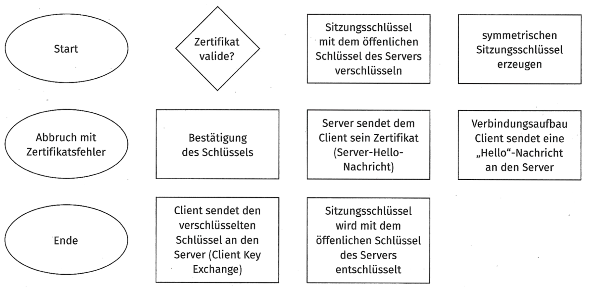
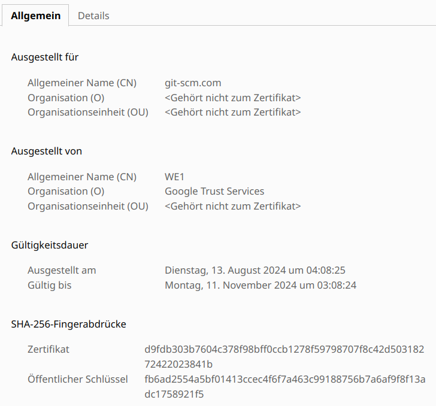
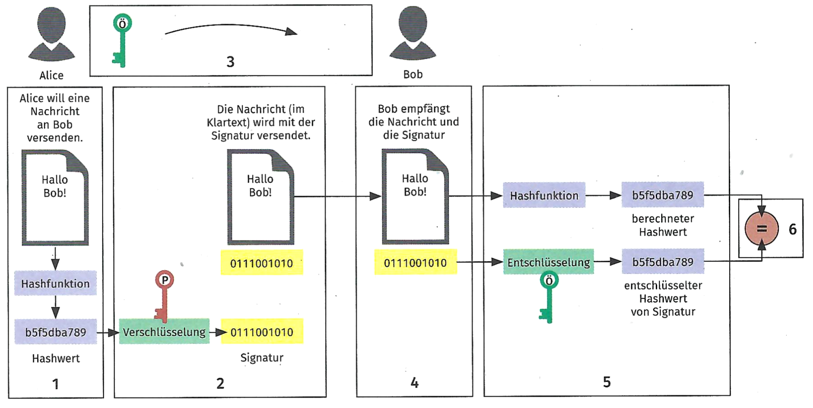

## Aufgabe 1

Erläutern Sie die Aufgabe eines Websersers.

## Aufgabe 2

Nennen Sie vier bekannte Webserver.

## Aufgabe 3

Vervollständigen Sie die Tabelle zu HTTP-Status-Codes

| Nummer | Status | Bedeutung |
|----|----|----|
| 200 | OK | Die Anfrage war erfolgreich und das Ergebnis wird übermittelt |
| 301 |  |  |
| 403 |  |  |
| 404 |  |  |

## Aufgabe 4

Erklären Sie, wozu im Zusammenhang mit HTTPS eine PKI mit Zertifikaten
benötigt wird und wie eine PKI funktioniert.

## Aufgabe 5

a)  Nach der Entscheidung für einen Webserver soll überlegt werden, ob
    der Einsatz von HTTPS sinnvoll ist. Beurteilen Sie, ob bei einem nur
    intern verwendeten Webserver der Einsatz des HTTPS-Protolkolls
    sinnvoll ist.

<!-- -->

b)  Vergleichen Sie die beiden Protokolle HTTP und HTTPS, indem Sie die
    Aussagen den Protokollen zuordnen.

    | Aussage                                             | HTTP | HTTPS |
    |-----------------------------------------------------|------|-------|
    | transportiert die Daten einer Webseite              |      |       |
    | kann die Authentizität einer Webseite sicherstellen |      |       |
    | verbraucht weniger Ressourcen                       |      |       |
    | kann Datenverkehr verschlüsseln                     |      |       |
    | verwendet Zertifikate                               |      |       |

<!-- -->

c)  Sie sollen die HTTPS-Technik in Verbindung mit TLS bei einem Meeting
    erläutern. Mit einem Programmablaufplan (PAP) lassen sich Abläufe
    grafisch darstellen. Durch die grafische Darstellung wird der Ablauf
    einfacher nachvollziehbar.

    Erstellen Sie aus den gegebenen Ablaufschritten einen
    Programmablaufplan, z. B. mit
    [PlantUML](https://plantuml.com/de/activity-diagram-beta). Dazu
    können sie den
    [PlantUML-Online-Editor](https://www.plantuml.com/plantuml/uml/)
    verwenden.

    

<!-- -->

d)  Der interne Webserver soll Zertifikate verwenden. Entscheiden Sie,
    welche Einsatzszenarien durch die Verwendung eines Zertifikats
    umgesetzt werden können.

    1.  Eine Verbindung kann durch Verschlüsselung abgesichert werden.

    2.  Ein Load Balancing zwischen Servern kann einfach ausgefuhrt
        werden.

    3.  Ein Server kann seine Identität nachweisen

    4.  Webseiten, die ein Zertifikat anbieten, werden besser von
        Suchmaschmen bewertet.

<!-- -->

e)  Ein Mitarbeiter möchte wissen, wie ein Zertifikat funktioniert. Er
    zeigt Ihnen ein Zertifikat einer besuchten Webseite.

    

    Erläutern Sie dem Mitarbeiter die Aufgabe des öffentlichen
    Schlüssels und des „Fingerabdrucks".

<!-- -->

f)  Bei der Kommunikation zwischen Server und Client werden sowohl die
    symmetrische als auch die asymmetrische Verschlüsselung eingesetzt.
    Geben Sie die grundlegenden Funktionsweisen an und nennen Sie Vor-
    und Nachteile der beiden Verschlüsselungsarten.

    | Verschlüsselungsart | Funktionsweise | Vorteile | Nachtefle |
    |----|----|----|----|
    | symmetrische Verschlüsselung | ein Schlüssel zur Ver- und Entschlüsselung |  | aufwendiger Schlüsselaustausch |
    | asymmetrische Verschlüsselung |  |  |  |

<!-- -->

g)  Ein wichtiger Ablauf bei der Arbeit mit Zertifikaten ist die
    digitale Signatur. Beschreiben Sie den Ablauf der digitalen
    Signatur, indem Sie die Abschnitte in der Grafik erläutern.

    

## Aufgabe 6: Zusatzaufgabe {#aufgabe-6}

Eine Seite des internen Webservers soll den Essensplan einer Kantine
abbilden. Sie sollen je ein kurzes Konzept für die Umsetzung als
statische Internetseite sowie als dynamische Internetseite erstellen.
