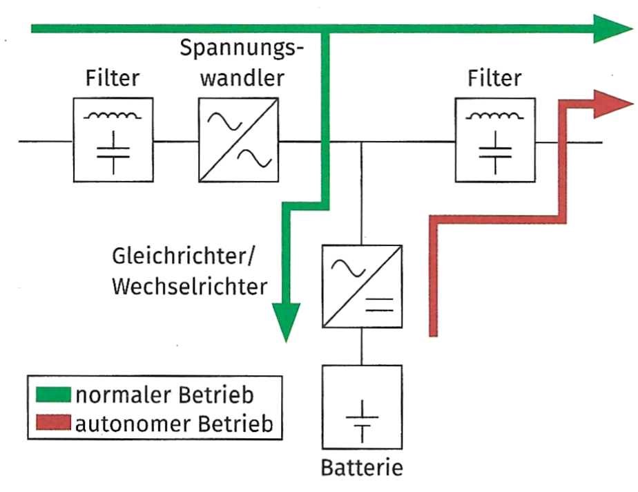
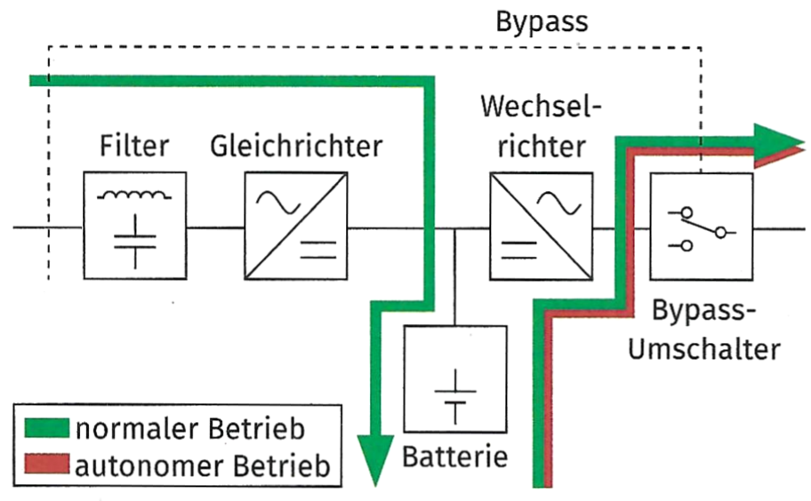
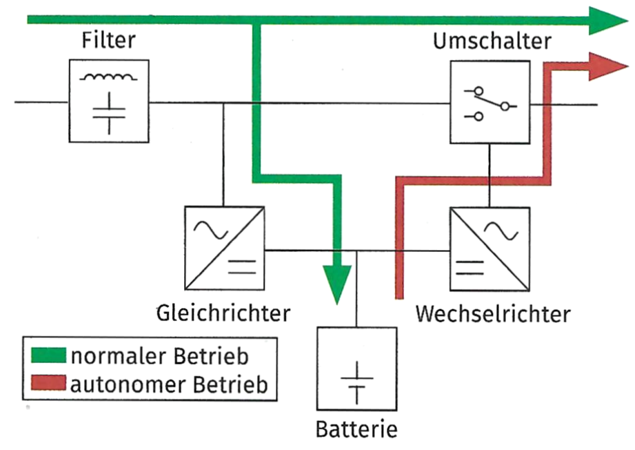
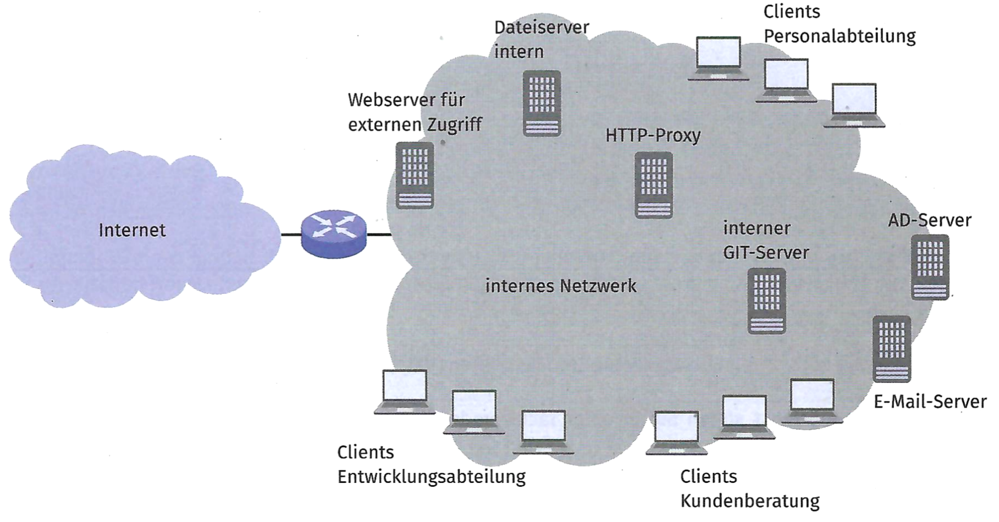

## Aufgabe 1

a)  Sie haben bei einem Anbieter für „Hosted Server" zwei Testserver
    gemietet. Auf diesen Auf der Webseite wirbt der Anbieter mit einer
    Verfügbarkeit von 99,95 %.

    Ermitteln Sie die maximale Anzahl der Stunden, die ein Server bei
    diesem Anbieter pro Jahr ausfallen darf.

<!-- -->

b)  Sie entscheiden sich für eine On-Premise-Lösung, also das Betreiben
    und Administrieren des Servers im eigenen Netzwerk.

    Der Serverdienst ist für das Katasteramt wichtig und ein Ausfall des
    Dienstes würde ein Weiterarbeiten der Mitarbeiter stark behindern.
    Sie möchten die Verfügbarkeit des Serversystems sicherstellen. Dazu
    gehört der Betrieb einer unterbrechungsfreien Stromversorgung (USV).

    Nennen Sie die jeweils dargestellte USV-Art.

    {width="50%"}

    {width="50%"}

    {width="50%"}

<!-- -->

c)  Nach der Wahl der USV entscheiden Sie sich, das System mit einem
    redundanten Netzteil auszustatten. Bei der Recherche über redundante
    Netzteile lesen Sie den Begriff „Hot Swapping". Sie haben diesen
    Begriff auch schon im Zusammenhang mit Speichermedien gehört.

    Erläutern Sie den Begriff.

<!-- -->

d)  Sie überlegen, ob es sinnvoll ist, dass ein Dienst auf mehreren
    Netzwerkknoten läuft und als Cluster-Dienst betrieben werden kann.

    Zusammen mit einer Kollegin gehen Sie die Vorteile von
    Active/Active-Clustern und Acüve/Passive- Clustern durch.

    Ordnen Sie die Aussagen den Cluster-Varianten zu.

    - Beim Ausfall eines Knoten wird die Last auf andere Knoten
      verteilt.

    - Sorgt für eine Erhöhung der Verfügbarkeit.

    - Nur ein Knoten verarbeitet Anfragen.

    - nicht so gut skalierbar

    - Anfragen werden von mehreren Knoten gleichzeitig verarbeitet.

    - Beim Ausfall eines Knotens übernimmt der andere Knoten die
      Verarbeitung von Anfragen.

    - gut skalierbar

    - bessere Ausnutzung von Systemressourcen

<!-- -->

e)  Ein Kollege fragt Sie nach dem Begriff „shared nothing" in Bezug auf
    Cluster.

    Erläutern Sie Ihrem Kollegen, was mit dem Begriff gemeint ist.

<!-- -->

f)  Um eine hohe Verfügbarkeit zu erreichen, ist es sinnvoll, den Dienst
    auf mehreren Systemen zu betreiben und eine Lastverteilung
    vorzunehmen.

    Ordnen Sie die Verteilungsverfahren den Erläuterungen zu.

    **Verfahren**

    - Round Robin

    - Hash Based

    - Least Connections

    - Least Response Time

    - Random Based

    **Erläuterungen**

    - Der Server mit den wenigsten Verbindungen wird ausgewählt.

    - Aus der Liste der verfügbaren Server wird einer per Zufall
      ausgewählt.

    - Aus Parametern des anfragenden Clients wird ein Schlüssel
      gebildet.

    - Anfragen dieses Clients werden immer zum gleichen Server gesendet.

    - Aus der Liste der vorhandenen Server wird der Reihenfolge nach
      ausgewählt.

    - Der Server mit der kürzesten Antwortzeit wird ausgewählt.

## Aufgabe 2

a)  Eine Anforderung an den zu installierenden Dienst ist die
    Skalierbarkeit. Bei der Skalierbarkeit unterscheidet man zwischen
    horizontaler und vertikaler Skalierung. Erläutern Sie den
    Unterschied kurz.

<!-- -->

b)  Ordnen Sie die Aussagen der Skalierungsart (vertikal / horizontal)
    zu.

    - Einem Cluster werden zusätzliche Knoten hinzugefügt.

    - Ein Load Balancer wird verwendet.

    - Das Serversystem wird mit 64 GiB RAM erweitert.

    - Die Lizenzkosten für die Skalierung sind niedriger.

    - Die Festplatten des Serversystems werden durch SSDs ersetzt.

    - Es wird mehr Platz benötigt.

<!-- -->

c)  Der Dienst soll auf einer virtuellen Maschine (VM) installiert
    werden. Prüfen Sie diese Lösung auf die Skalierbarkeit und erläutern
    Sie die Möglichkeiten der Skalierung.

## Aufgabe 3

a)  Für den Einsatz eines Servers sollen Sie die Administrierbarkeit der
    Rolle „DHCP-Server" des Windows-Servers anhand der angegebenen
    Kriterien überprüfen

    - konfigurierbar:

    - Dokumentation:

    - Überwachung:

    - regelmäßige Sicherheitsupdates:

    - unterschiedliche Berechtigungen:

<!-- -->

b)  Sammneln Sie in Partnerarbeit weitere Aspekte, die die
    Administrierbarkeit eines Servers erhöhen.

## Aufgabe 4

a)  Es soll die Wirtschaftlichkeit von Serverdiensten betrachtet werden.
    Der Serverdienst soll mit einem Programm erweitert werden. Für die
    Erweiterung gibt es zwei Möglichkeiten.

    Die Erweiterung kann intern erstellt werden. Dazu wird mit 300
    Arbeitsstunden für die Entwicklung gerechnet. Außerdem muss die
    Erweiterung gewartet werden. Für diese Wartung werden jährlich 24
    Arbeitsstunden kalkuliert. Eine Arbeitsstunde wird intern mit 70,00
    € verrechnet.

    Für eine Fremdentwicklung des Programms liegt ein Angebot von
    15000,00 € vor. Für die jährliche Wartung des Programms
    (Sicherheits-Patches) werden 3 000,00 € im Angebot veranschlagt.

    Berechnen Sie, ab welchem Jahr sich die Eigenentwicklung lohnt.
    Runden Sie auf volle Jahre auf.

<!-- -->

b)  Ein kleineres Unternehmen möchte wissen, ob sich die automatische
    Installation von Endsystemen lohnt. Im Jahr werden bei diesem Kunden
    durchschnittlich 20 Endsysteme neu installiert. Eine Installation
    (von Betriebssystem sowie Basissoftware) und die grundlegende
    Konfiguration werden pro System mit 5 Arbeitsstunden angesetzt.

    Sie kalkulieren für die Installation und Konfiguration einer
    Software zum Verteilen von Betnebssystem und Software mit 5000,00 €.
    Für die Installation der Endsysteme und die Paketierung neuer
    Softwarepakete kalkulieren Sie 40 Stunden pro Jahr durch
    Mitarbeitende des Kunden.

    Auf Nachfrage stellt sich heraus, dass interne Arbeitsstunden im
    Kundenunternehmen mit 80,00 € pro Stunde verrechnet werden.

    Ermitteln Sie, ob und ab welchem Einsatzmonat sich eine automaUsche
    Installation und Softwareverteilung für das Unternehmen lohnt.

## Aufgabe 5

a)  Neben der Wirtschaftlichkeit ist vor allem die Sicherheit von großer
    Bedeutung. Das Katasteramt plant den Aufbau eines weiteren Servers.
    Im Leitfaden des BSI steht, dass das Betriebssystem gehärtet werden
    muss. Sie sollen den Auszubildenden aus dem ersten Ausbildungsjahr
    erläutern, was unter diesem Begriff verstanden wird.

    Beschreiben Sie den Begriff Härtung eines Betriebssystems und geben
    Sie ein Beispiel dafür an.

<!-- -->

b)  Nachdem Sie das Thema „Härtung" mit den Auszubildenden des ersten
    Lehrjahres besprochen haben, werden verschiedene Nachfragen
    gestellt. Ein Auszubildender berichtet davon, dass er von Programmen
    gehört hat, die „nach Hause telefonieren" und Benutzerdaten an den
    Hersteller senden. Er meint, dass dieses Verhalten sicherlich im
    Zuge einer „Härtung" abgeschaltet werden muss.

    Recherchieren Sie im BSI-Leitfaden „Konfigurationsempfehlungen zur
    Härtung von Windows mit Bordmitteln" zum Thema „Telemetrie".
    Erläutern Sie die Empfehlungen, die der Leitfaden gibt.

<!-- -->

c)  Nicht nur einzelne Systeme müssen besonders geschützt sein, sondern
    auch ganze Abschnitte von Netzwerken. Es ist sinnvoll, ein Netzwerk
    in abgrenzte Bereiche einzuteilen, in denen unterschiedliche
    Sicherheitsniveaus gelten.

    Gegeben ist das nachfolgende Netzwerk. Bilden Sie sinnvolle Zonen
    und zeichnen Sie diese ein.

    

## Aufgabe 6: Zusatzaufgabe {#aufgabe-6}

Ein Kunde möchte sich über das Zero-Trust-Prinzip informieren. Sie
werden gebeten, zwei Präsentationsfolien zu erstellen, die das Konzept
beschreiben. Berücksichtigen Sie dabei die Regelung des Zugriffs, sowie
mögliche Ansätze zur Umsetzung. Skizzieren Sie die Folien.
